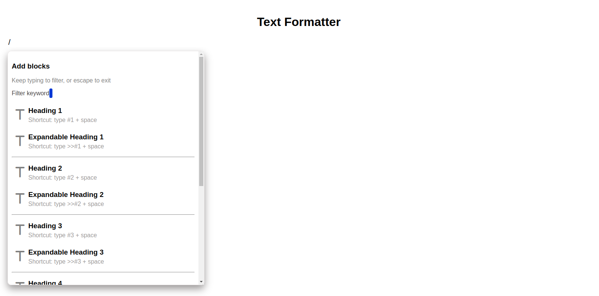
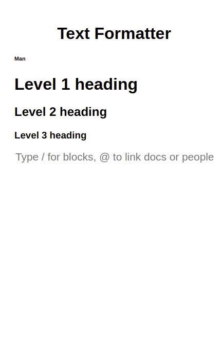

# Text Formatter
This application converts text typed in an input to different levels of heading. You can choose from h1 to h6 HTML heading elements to convert your text to.
## Built With

- HTML
- CSS
- JavaScript
- Jest
- Netlify

## Screenshot
### Desktop

### Mobile

## Getting Started

To get a local copy up and running follow these simple example steps in the command line:

1. Clone the repo: `https://github.com/HENRYKC24/Text-Formatter.git`

2. Go to the project folder: `cd Text-Formatter`

3. Open the live server in VS Code. OR
4. Run the index.html file

## Live Demo

[View Live!](https://bucolic-granita-f2d53b.netlify.app/)
## Run Tests
Run `npm test` from the command line.

## How To Use The App
- You type the '/' character to start followed by any number denoting the level of heading you want to display the text with. Eg. '/1', '/2', ... '/6'. (The '@' linking character is not working at the moment).
- Press the Enter key to begin typing your text.
- Tell the application that you are done with the text by pressing the Enter key.
- The inputted text will show up in the output section formatted as specified in the previous step.
- When you begin typing with the '/' character, a list of all the headings will appear below the input section. You can click any level heading and it will be used to convert the text you will enter next in the same input field.

*Note: The expanded heading was not implemented yet. They work in the same way as their respective heading counterparts.*

### Shortcuts
- To set up the input field for 'Heading 1' text format, type '#1' followed by a space.
- To set up the input field for 'Heading 2' text format, type '#2' followed by a space.
- To set up the input field for 'Heading 3' text format, type '#3' followed by a space.
- To set up the input field for 'Heading 4' text format, type '#4' followed by a space.
- To set up the input field for 'Heading 5' text format, type '#5' followed by a space.
- To set up the input field for 'Heading 6' text format, type '#6' followed by a space.

*Note: If you had typed '/' initially, you can proceed with the above shortcuts in addition and it will still work properly.*

## Author

👤 **Henry Kc**

- GitHub: [@githubhandle](https://github.com/henrykc24)
- Twitter: [@twitterhandle](https://twitter.com/henrykc24)
- LinkedIn: [LinkedIn](https://linkedin.com/in/henry-kc)

## 🤝 Contributing

Contributions, issues, and feature requests are welcome!

Feel free to check the [issues page](https://github.com/HENRYKC24/Text-Formatter/issues/).

## Show your support

Give a ⭐️ if you like this project!

## Acknowledgments

- Special thanks to every software developer whose code was used in this application.

## 📝 License

This project is [MIT](./LICENSE) licensed.